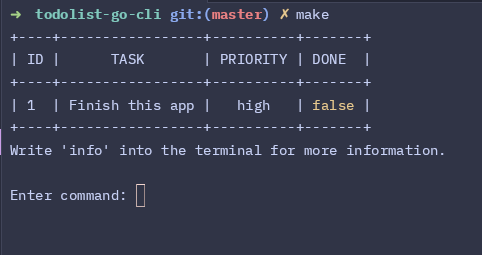
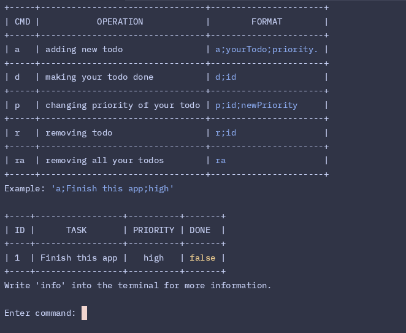
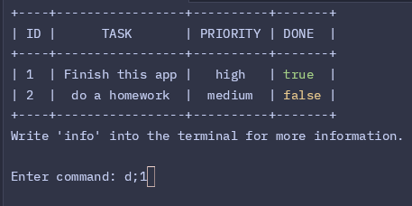
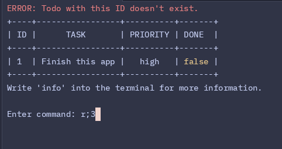
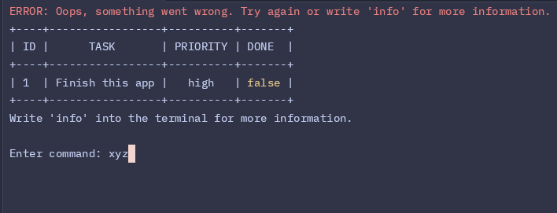

# Simple CLI Todolist in Go

This is a simple Command Line Interface (CLI) Todo List application written in Go. It allows users to manage their tasks by adding, marking tasks as done, changing task priority, and removing tasks. This is my first Go project, created as a learning exercise to get familiar with Go programming and its ecosystem.

## Features

- Add new todos with a priority level.
- Mark todos as done.
- Change the priority of existing todos.
- Remove specific todos or clear the entire list.
- Display all todos in a neatly formatted table in the terminal.

## Getting Started

### Prerequisites

- [Go](https://golang.org/doc/install) installed on your machine.
- A terminal or command line interface.

### Installation

1. Clone the repository or download the source code:
   ```bash
   git clone https://github.com/patvoj/todolist-go-cli/.git
   cd todolist-go-cli
   ```

### Running the Application

You can build and run the application easily using the `make` command. Simply execute the following:

```bash
make
```


### Commands

| Command | Description                   | Format                                |
| ------- | ----------------------------- | ------------------------------------- |
| `a`     | Add a new todo                | `a;task;priority`                     |
| `d`     | Mark a todo as done           | `d;id`                                |
| `p`     | Change the priority of a todo | `p;id;new priority`                   |
| `r`     | Remove a specific todo        | `r;id`                                |
| `ra`    | Remove all todos              | `ra`                                  |
| `info`  | Display help information      | `info`                                |

### Examples

Add a new task with high priority:
```bash
a;Finish learning Go;high
```
Mark the task with ID 2 as done:
```bash
d;2
```
Change the priority of the task with ID 3 to low:
```bash
p;3;low
```
Remove the task with ID 4:
```bash
r;4
```
Remove all tasks:
```bash
ra
```
Display information about available commands:
```bash
info
```

Application includes a both ID and argument validation and returns error if invalid input is provided.

### Screenshots from app
- Start of the app


- Screen after writing command 'info'


- Screen after making todo done


- Error message after providing invalid ID


- Error after invalid command


